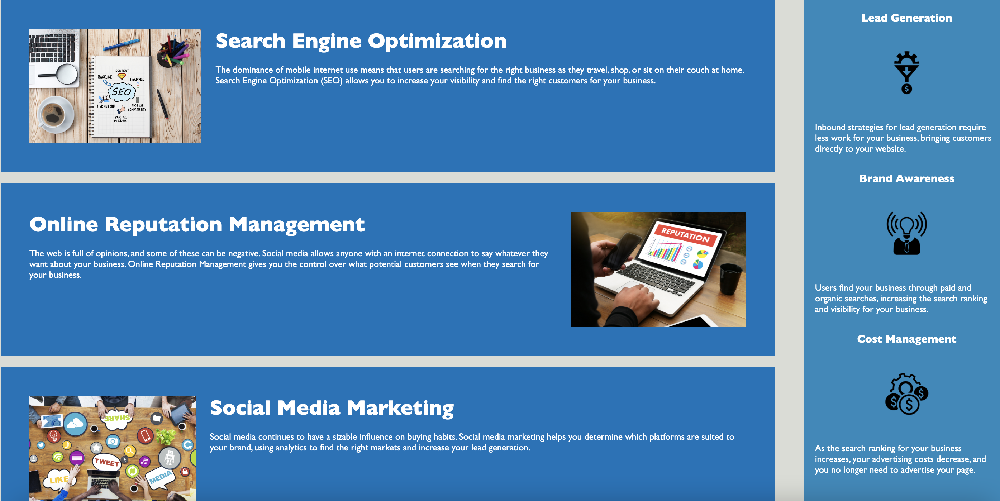

# Module 1 Challenge Code Refactor

## Description 
What: In this challenge, I have refactored existing code. This was an on-the-job ticket where I modified existing starter code. Refactoring is the process of restructuring existing code, without changing its original functionality. 

Why: I completed this challenge because it addresses an important aspect of all web development - accessibility. I followed the Scout Rule. This means,when working with code that was not originally written by yourself, you should always leave it a little 'cleaner' than you found it. 

There are a few benefits to refactoring code. It makes it cleaner so it is easier to read and understand, it is easier for software developers to identify and fix bugs, and makes the code more resuable/it can be duplicated, again increasing efficiency and readibility. 

How: I have ensured the website meets the accessibility sgandards by completing the following: 
<ul>
  <li>Semantic HTML elements can be found throughout the source code</li>
  <li>HTML elements follow a logical structure independent of styling and positioning</li>
  <li>Image and icon elements contain accessible alt attributes</li>
  <li>Heading attributes fall in sequential order</li>
  <li>Title elements contain a concise, descriptive title</li>
</ul>

## Table of Contents

* [Description](#description)
* [Installation](#installation)
* [Usage](#usage)
* [Code](#code)
* [Credits](#credits)
* [License](#license)

## Installation

1. Create a new repository on your GitHub account and clone it to your computer.

2. Add the starter code to the new repo on your computer and work through the Challenge.

3. When you’re ready to deploy, use the git add, git commit, and git push commands to save and push your code to your GitHub repository.

4. Navigate to your GitHub repository in the browser and then select the Settings tab on the right side of the page.

5. On the Settings page, scroll down to the GitHub Pages section. Then, in the section labeled Source, select the main branch as your source.

6. Navigate to and you will find that your new webpage has gone live! For example, if your GitHub username is “lernantino” and the project is “css-demo-site”, then your URL would be .


## Usage 

```md

```

## Code

<ul>
    <li>HTML</li>
    <li>CSS</li>

## Credits

Code refactored by Amina Ghafor
Contact: aminarghafor@gmail.com 

Existing resources: Drew Hoang https://fantastic-pudding.vercel.app/

## License

MIT License

Copyright (c) [2022] [Amina Ghafor]

Permission is hereby granted, free of charge, to any person obtaining a copy
of this software and associated documentation files (the "Software"), to deal
in the Software without restriction, including without limitation the rights
to use, copy, modify, merge, publish, distribute, sublicense, and/or sell
copies of the Software, and to permit persons to whom the Software is
furnished to do so, subject to the following conditions:

The above copyright notice and this permission notice shall be included in all
copies or substantial portions of the Software.

THE SOFTWARE IS PROVIDED "AS IS", WITHOUT WARRANTY OF ANY KIND, EXPRESS OR
IMPLIED, INCLUDING BUT NOT LIMITED TO THE WARRANTIES OF MERCHANTABILITY,
FITNESS FOR A PARTICULAR PURPOSE AND NONINFRINGEMENT. IN NO EVENT SHALL THE
AUTHORS OR COPYRIGHT HOLDERS BE LIABLE FOR ANY CLAIM, DAMAGES OR OTHER
LIABILITY, WHETHER IN AN ACTION OF CONTRACT, TORT OR OTHERWISE, ARISING FROM,
OUT OF OR IN CONNECTION WITH THE SOFTWARE OR THE USE OR OTHER DEALINGS IN THE
SOFTWARE.